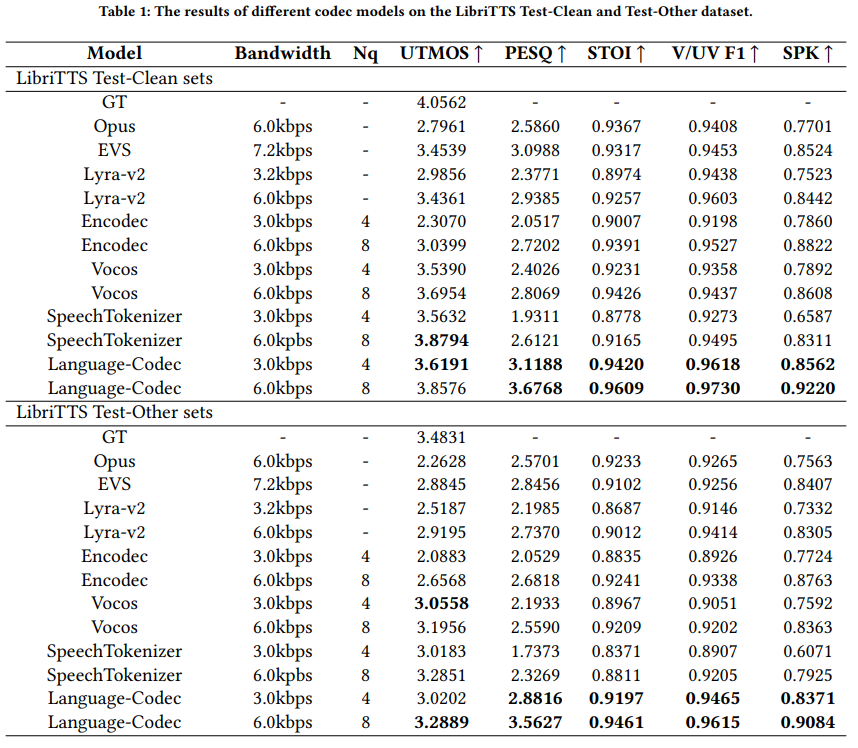

# Language-Codec: Reducing the Gaps Between Discrete Codec Representation and Speech Language Models


[](https://arxiv.org/pdf/2402.12208.pdf)
[](https://languagecodec.github.io)
[-blue)](https://drive.google.com/file/d/1ENLyQzbJm2BTignliHHZl11DmQdWZAoX/view?usp=drive_link)


# 🔥 News
- *2024.11*: We release WavChat (A survey of spoken dialogue models about 60 pages) on arxiv.
- *2024.08*: 🎉🎉 We have open-sourced a SOTA Codec model [WavTokenizer](https://github.com/jishengpeng/WavTokenizer), which can reconstruct speech, music, and audio using only 40 tokens one-second!
- *2024.04*: We update Languagecodec and release a more powerful checkpoint.
- *2022.02*: We release Languagecodec on arxiv.




## Installation

To use Language-Codec, install it using:

```bash
conda create -n xxx python=3.8
conda activate xxx
pip install -r requirements.txt
```

## Infer

### Part1: Reconstruct audio from raw wav

```python

from languagecodec_encoder.utils import convert_audio
import torchaudio
import torch
from languagecodec_decoder.pretrained import Vocos

device=torch.device('cpu')

config_path = "xxx/languagecodec/configs/languagecodec.yaml"
model_path = "xxx/xxx.ckpt"
audio_outpath = "xxx"
languagecodec = Vocos.from_pretrained0802(config_path, model_path)
languagecodec = languagecodec.to(device)

wav, sr = torchaudio.load(audio_path)
wav = convert_audio(wav, sr, 24000, 1) 
bandwidth_id = torch.tensor([0])
wav=wav.to(device)
features,discrete_code= languagecodec.encode_infer(wav, bandwidth_id=bandwidth_id)
audio_out = languagecodec.decode(features, bandwidth_id=bandwidth_id) 
torchaudio.save(audio_outpath, audio_out, sample_rate=24000, encoding='PCM_S', bits_per_sample=16)
```


### Part2: Generating discrete codecs
```python

from languagecodec_encoder.utils import convert_audio
import torchaudio
import torch
from languagecodec_decoder.pretrained import Vocos

device=torch.device('cpu')

config_path = "xxx/languagecodec/configs/languagecodec.yaml"
model_path = "xxx/xxx.ckpt"
languagecodec = Vocos.from_pretrained0802(config_path, model_path)
languagecodec = languagecodec.to(device)

wav, sr = torchaudio.load(audio_path)
wav = convert_audio(wav, sr, 24000, 1) 
bandwidth_id = torch.tensor([0])
wav=wav.to(device)
_,discrete_code= languagecodec.encode_infer(wav, bandwidth_id=bandwidth_id)
print(discrete_code)
```


### Part3: Audio reconstruction through codecs
```python
# audio_tokens [n_q,1,t]/[n_q,t]
features = languagecodec.codes_to_features(audio_tokens)
bandwidth_id = torch.tensor([0])  
audio_out = languagecodec.decode(features, bandwidth_id=bandwidth_id)
```


## Pre-trained models

| Model Name                                                                          | Dataset       | Training Iterations 
-------------------------------------------------------------------------------------|---------------|---------------------
| [languagecodec_paper_8nq](https://drive.google.com/file/d/1ENLyQzbJm2BTignliHHZl11DmQdWZAoX/view?usp=drive_link)         | 5W Hours      | 2.0 M           

## Training

### Step1: Prepare train dataset
```python
# Process the data into a form similar to xxx/languagecodec/data/libritts_testother.txt
```

### Step2: Modifying configuration files
```python
# xxx/languagecodec/configs/languagecodec_mm.yaml
# Modify the values of parameters such as batch_size, filelist_path, save_dir, device
```

### Step3: Start training process
Refer to [Pytorch Lightning documentation](https://lightning.ai/docs/pytorch/stable/) for details about customizing the
training pipeline.

```bash
cd xxx/languagecodec
python train.py fit --config xxx/languagecodec/configs/languagecodec_mm.yaml
```


## Citation

If this code contributes to your research, please cite our work:

```
@misc{ji2024languagecodec,
      title={Language-Codec: Reducing the Gaps Between Discrete Codec Representation and Speech Language Models}, 
      author={Shengpeng Ji and Minghui Fang and Ziyue Jiang and Rongjie Huang and Jialung Zuo and Shulei Wang and Zhou Zhao},
      year={2024},
      eprint={2402.12208},
      archivePrefix={arXiv},
      primaryClass={eess.AS}
}
```

## License

The code in this repository is released under the MIT license as found in the
[LICENSE](LICENSE) file.
